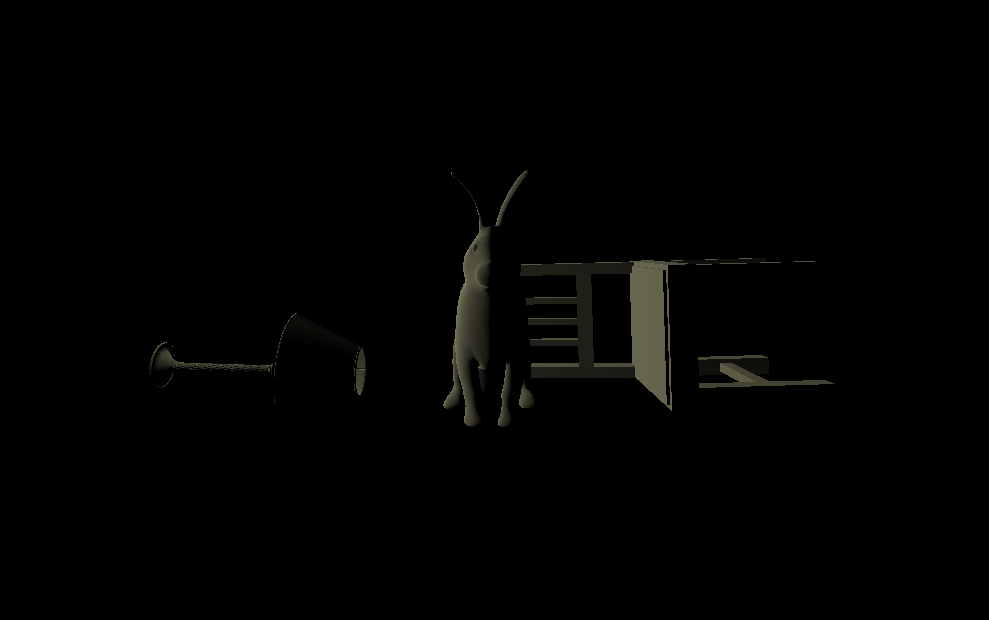

# CMPM163Labs

This is my (Nicholas Gleason) repository for all lab projects for CMPM 163 of Spring Quarter 2020
## Lab 5
For this lab, I did Part 2 (the Three.js project)

Link to Part A: https://drive.google.com/file/d/1aFUX73jFgzkhsL4kgoXkHjK9wiOiJ8G3/view?usp=sharing

Link to Part B: https://drive.google.com/file/d/16oih9PNAA7MsW9t_9S-AEGau3z54Q39P/view?usp=sharing

Link to Part C: https://drive.google.com/file/d/13zUleRhFueq8A1duuYCDa3dK8xnd037r/view?usp=sharing

## Lab 4
Link to Capture: https://drive.google.com/file/d/1bPI3MdOv0q_Cn4KNy-NUdXCaTGNYMFqy/view?usp=sharing

Description of Cubes:
- Left Cube: Part 1 Tutorial w/o normal map
- Center Cube: Part 1 Tutorial w/ normal map
- Top Cube: Part 1 myTexture w/ my normal Map
- Right Cube: Part 2 Tutorial Shader Texture
- Bottom Cube: Part 2 Tiled Shader Texture

Answers to step 24:
- A. x = 7u
- B. y = 7 - 7v
- C. white

## Lab 3

Link to Capture: https://drive.google.com/file/d/18G5C1GARodSfN0K0Q738V8aniOBj6Hjb/view?usp=sharing

Description of Cubes:

- Left Cube = This is my own shader where I made the time (u_time) and resolution of the renderer (u_resolution) alternate the color gradients of the cube.  The RGB values are set equal to the absolute value of sin(u_time) or cos(u_time) which is then multiplied by gl_FragCoord.x/u_resolution.
- Top Cube = this is my own part 1 cube.  For the material, I set the wireframe of the material to true, and added a light blue specular attribute to it.  As a result, the wireframe shines with a tinge of blue.
- Middle Cube = This is the part 1 tutorial cube.  the code is unchanged.
- Right Cube = This is the part 2 tutorial cube.  The only change that I made is the color interpolation, in that it is now red and blue.

## Lab 2

Link to Part 1 Video: https://drive.google.com/file/d/1YCGIwYGkGstwwTIOj-Kz_fDuFxAumllf/view?usp=sharing

Part 2 Screenshot:

